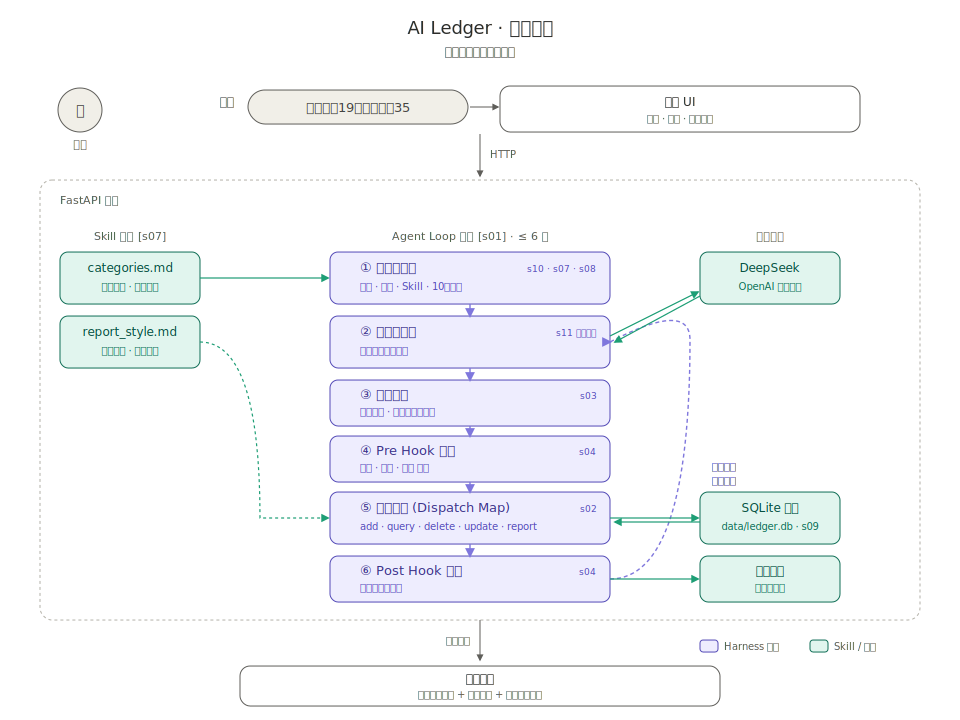

# 对话式AI记账助手 · 产品设计文档

- 日期：2026-07-05
- 状态：设计已确认（各模块已在对话中逐节评审通过）
- 用途：两天 vibe coding 的面试 Demo；同时是作者自用的真实产品
- 阅读说明：每个模块含专业描述与【小白版】比喻，前者面试用，后者复习用

---

## §0 一句话定位

把记账的录入成本从"打开App→选分类→填金额"降到"说一句话"。

**核心假设**：记账App留存低的根因是录入摩擦；自然语言交互能把摩擦降到接近零。两天内的一切工作都为验证这个假设服务。

---

## §1 产品定义与功能范围

### 功能范围（MVP）

| 功能 | 说明 | 优先级 |
|---|---|---|
| 对话记账 | "早上咖啡19，中午外卖32" → 自动解析成多笔结构化账目 | P0 |
| 对话查账 | "这个月吃饭花了多少？" → 直接回答+明细 | P0 |
| 账本视图 | 账目列表 + 本月分类汇总图表，随对话实时刷新 | P0 |
| 消费洞察报告 | 一键生成本月消费分析（趋势、异常、建议） | P0 |
| 批量账单导入 | 粘贴微信/支付宝账单文本，批量识别入账 | P1（有余量再做） |

### 刻意不做（及理由，分三类）

| 不做 | 理由类型 | 说明 |
|---|---|---|
| 多用户/登录 | 伪需求 | 单用户场景，登录服务的"区分用户数据"需求不存在；商业化时第一个补 |
| 预算提醒 | 错的阶段 | 提醒价值依赖数据积累，验证期演示不出效果；且属传统功能，不体现AI能力 |
| 语音输入 | 高成本低边际收益 | 文本已把摩擦降到很低；语音引入整条新技术链路且两级误差叠加易翻车 |
| App端 | 高成本低边际收益 | 独立技能栈；手机浏览器打开网页已够演示 |

---

## §2 技术架构



### 怎么读这张图

- **从上往下 = 一次对话的完整流程**：用户说话 → 前端 → FastAPI 后端 → Agent Loop 处理 → 最终回复刷新前端
- **紫色格子 = Harness 环节**（8 件 AI 工程"装备"）：①②③④⑤⑥ 按顺序纵向串成 Agent Loop，右上角的 `s01/s02/…` 是对应完整 20 环节图谱里的编号
- **青绿色格子 = Skill 与外部资源**：左侧两个 Skill 文件、右侧 DeepSeek 与 SQLite；箭头**实线**=常驻注入、**虚线**=按需注入
- **右上角虚线回环**：Agent Loop 的心跳——模型说"要调工具"就顺序往下走一遍，工具结果回传给模型继续想，直到不再调工具输出最终回复（**最多 6 轮，给自主性画硬边界**）

### 文字简化版（备份，方便 grep）

```
浏览器（单页应用：聊天框 + 账本视图 + 图表）
        │ HTTP
Python FastAPI 后端
        ├── Agent Loop（核心）→ 国内大模型 API（OpenAI兼容接口）
        ├── 5个工具：记账/查账/删账/改账/报告
        ├── skills/ 目录（categories.md、report_style.md）
        └── SQLite 本地数据库（expenses 表）
```

- 模型：国内大模型（DeepSeek/Kimi/智谱等），OpenAI 兼容接口，base_url 和 model 可配置切换
- 数据表 expenses：id、金额、分类、日期、备注、创建时间

### 为什么全部本地运行、不部署（四个理由同时成立）

1. **演示用不上**：面试演示走本地 localhost，不依赖现场网络（只有调模型API需要联网）
2. **时间花不起**：部署顺利小半天、不顺利一整天，对产品质量零贡献
3. **数据不该出去**：真实消费数据留在本地 SQLite，"个人财务数据的最小信任方案就是不出本机"
4. **架构不受损**：Agent循环/工具/校验/Skill 一个不少；要上线时 Docker 打包即可，架构不用动

---

## §3 Harness 设计（面试核心谈资）

【小白版总纲】大模型本身只会"进文字、出文字"：记性为零、没有手脚、不知道日期、偶尔胡说。Harness（本意"马具"）就是套在它身上让它能干活的全套装备。本产品共 8 件装备。

### 3.0 一条消息的完整生命周期

```
用户消息
   ↓
① 组装上下文 [s10+s07+s08]
   系统提示词 + 今天日期 + categories.md(常驻Skill) + 最近10轮历史(截断)
   ↓
② Agent循环 [s01]（while True，上限6轮）
   ├─ 调用大模型（附带5个工具定义 [s02]）
   ├─ 模型要调工具 → ③ 权限检查 [s03]：allow放行 / ask挂起等确认
   │                → ④ PreToolUse钩子 [s04]：schema校验
   │                     失败 → 错误原因回传模型重试 [s11]
   │                → ⑤ 查表执行工具 [s02] ←→ SQLite [s09]
   │                → ⑥ PostToolUse钩子 [s04]：结构化日志
   │                → 结果回传，继续循环
   └─ 正常结束 → 输出最终回复
   ↓
前端刷新账本视图
```

### 3.1 System Prompt 运行时组装 [s10] + Skill 注入 [s07]

- 每次请求分段拼接：[角色与规则] + [今天日期/星期] + [categories.md 全文]
- categories.md **常驻注入**（每轮都要分类）；report_style.md **按需注入**（仅 generate_report 时随统计数据递给模型）
- 【小白版】模型每次都像第一次见你，所以每次都要递"任务说明书"；Skill 是说明书里可随时替换的那几页
- 面试讲点：模型知道的一切都来自这次组装；按需注入 = token 经济学 + 减少干扰

### 3.2 Agent 循环 [s01]

- messages 数组 + while True + stop_reason 判断；工具结果 append 后继续循环
- **循环上限6轮**，超出强制终止并告知用户
- 【小白版】模型说→程序做→结果给回模型→接着说，像对讲机来回
- 面试讲点：上限=给自主性画硬边界（防不可控延迟和费用）；实测单笔记账1~2轮、记账+查询3~4轮

### 3.3 工具定义与 dispatch map [s02]

| 工具 | 关键参数 | 权限 |
|---|---|---|
| add_expense | 金额、分类、日期、备注 | 自动放行 |
| query_expenses | 起止日期、分类、聚合方式(明细/求和/分组) | 自动放行 |
| delete_expense | 账目id | 需确认 |
| update_expense | 账目id、要改的字段 | 需确认 |
| generate_report | 月份 | 自动放行 |

- 执行侧为查表分发：TOOL_HANDLERS = {工具名: 处理函数}
- **工具边界是产品决策**：query 不让模型写SQL，参数化查询换来安全（不可能删库）、可控（能力上限由我定义）、可测（参数组合可穷举）
- 【小白版】模型没有手，只能按我们给的5个按钮；查账按钮像自动售货机，只能选有的商品
- 面试讲点：dispatch map = 加新工具只需注册新 handler，主循环不改

### 3.4 权限管线 [s03]

- 规则表：{增/查/报告: allow，删/改: ask}
- ask 流程：循环挂起 → 前端确认卡片 → 确认执行 / 取消则把"用户拒绝"作为工具结果回传
- 面试讲点：增删**不对称**——增高频低风险（加确认毁体验），删改低频不可逆（必须有人类闸门）；与 Claude Code 审批 rm -rf 机制同构、场景各异

### 3.5 Hooks 扩展点 [s04]

- pre_tool_use(工具, 参数)：校验站——金额为正、日期合法不在未来、分类在集合内；不过则拦截并返回具体原因
- post_tool_use(工具, 参数, 结果)：日志站——一行JSON（时间、轮次、工具、参数、结果摘要、耗时）
- 【小白版】按钮前过安检门，按钮后摄像头记流水
- 面试讲点：散落的校验/日志收敛成命名扩展点，未来预算提醒=挂新钩子；日志是演示大杀器（现场拉出日志看模型跑了几轮）

### 3.6 错误恢复三层 [s11]

| 层 | 错误 | 策略 |
|---|---|---|
| API层 | 超时、限流 | 自动重试2次（间隔递增），仍失败友好提示 |
| 校验层 | 参数没过 pre-hook | 把**具体错误原因**回传模型重试，仅1次 |
| 语义层 | 理解不了/信息不足 | 不猜，反问用户 |

- 面试讲点：带着错误原因重试（盲目重试浪费钱）；"宁可反问，不可瞎记"=本场景的幻觉容忍策略——给场景定幻觉策略是AI PM核心判断

### 3.7 上下文截断 [s08 简化版]

- 只保留最近10轮；截断点不能落在"工具调用→工具结果"配对中间（API要求成对），需回退到完整对话边界
- 为什么不做四层压缩：记账是短事务对话，几乎不依赖10轮前信息，压缩收益为零
- 面试讲点：说得出简化方案里的坑（配对截断），比说得出复杂方案的名词更证明动过手

### 3.8 记忆 [s09 半做]

- 长期记忆 = SQLite 账本；短期记忆 = messages 数组（滚动10轮）
- 不做偏好记忆（"老地方=楼下便利店"），留作V2（selection→extraction→consolidation）
- 面试讲点：记忆不是玄学，就是 Harness 对外部存储的读写

### 3.9 完整图谱的取舍（20环节选9）

| 章节 | 环节 | 决策 | 一句话理由 |
|---|---|---|---|
| s01 | Agent Loop | ✅ 完整做 | 产品心脏 |
| s02 | Tool Use | ✅ 完整做 | 5工具+dispatch map，AI PM发力点 |
| s03 | Permission | ✅ 轻量做 | 一条规则的迷你审批管线 |
| s04 | Hooks | ✅ 轻量做 | 校验=Pre、日志=Post，顺手就有 |
| s05 | TodoWrite | ❌ | 为多步长任务设计；记账2~4轮即结束 |
| s06 | Subagent | ❌ | 单Agent覆盖全部需求（批量导入可作迷你实践谈资） |
| s07 | Skill Loading | ✅ 做 | 常驻+按需两种注入策略 |
| s08 | Context Compact | ⚠️ 简化 | 只做截断，不做四层压缩 |
| s09 | Memory | ⚠️ 半做 | 账本即记忆；偏好记忆进V2 |
| s10 | System Prompt | ✅ 完整做 | 运行时分段拼接 |
| s11 | Error Recovery | ✅ 轻量做 | 三层策略；不做fallback模型 |
| s12 | Task System | ❌ | 记账是秒级事务，无跨天任务 |
| s13 | Background Tasks | ❌ | 最慢操作几秒，同步等待可接受 |
| s14 | Cron Scheduler | ❌→V2 | 定时周报演示不出效果 |
| s15 | Agent Teams | ❌ | 多Agent解决并行复杂工程，场景不存在 |
| s16 | Team Protocols | ❌ | 没有团队就没有协议 |
| s17 | Autonomous Agents | ❌ | 没有"空闲时该自主干的活" |
| s18 | Worktree Isolation | ❌ | 纯编程Agent机制，与记账无关 |
| s19 | MCP Plugin | ❌→V2 | 多客户端接入时才有收益 |
| s20 | Comprehensive Agent | — | 汇总概念，本产品即其迷你版 |

**砍掉的11个按三类理由**：①场景不存在（s05/s06/s12/s15/s16/s17/s18，均为长时程并行软件工程设计）②演示不出价值留作V2（s14、s09偏好记忆）③收益前提未到（s19多客户端、s13慢操作、s08长对话）

---

## §4 Skill 设计

【小白版总纲】Harness 决定AI"能做什么"（工位、权限卡、流程）；Skill 决定AI"懂什么、按什么规矩做"（桌上的业务手册）。手册随时可以换页。

### 两个 Skill 文件

**skills/categories.md —— 分类业务手册（常驻注入）**

```markdown
# 记账分类规则

## 分类体系
- 餐饮：正餐 / 饮品 / 零食
- 交通：通勤 / 打车
- 娱乐：游戏 / 电影演出 / 会员订阅
- 日用：日用品 / 服饰
- 其他：人情往来 / 医疗 / 无法归类的

## 判断规则
- 瑞幸、星巴克、蜜雪冰城 → 餐饮-饮品
- 外卖平台的订单默认 → 餐饮-正餐
- 地铁、公交 → 交通-通勤
- 视频网站、音乐App的包月 → 娱乐-会员订阅
- 拿不准的：不要猜，反问用户
```

**skills/report_style.md —— 月报写作手册（按需注入）**

```markdown
# 消费月报生成规则

## 报告结构
1. 本月总支出 + 和上月比的变化
2. 前三大分类，各自占比
3. 一个"值得注意"的发现（比如某分类突然暴涨）
4. 一条具体可执行的建议（别说空话）

## 语气要求
- 像朋友聊天，不像银行对账单
- 可以适度调侃，但不许说教
- 全文不超过300字
```

### 为什么做成文件而不是写死代码

1. **改行为不用动代码**：把易变的（分类规则）和稳定的（代码）分开放
2. **产品经理自己能维护**：调教AI从技术活变成运营活
3. **业界同构**：Claude Code 的 SKILL.md、课程表 s07 的 SkillManifest 都是同一思想；本产品是最小实现

### 刻意不做：SkillManifest（技能清单/目录系统）

Manifest=清单。SkillManifest 的机制：说明书里只放各技能的一行简介目录，模型按需请求某技能全文。它解决的是技能**规模化**（几十个文件）后的按需加载问题。本产品只有2个文件，加载策略直接写死（一个常驻、一个跟报告工具走）。面试话术："规模上去后第一个补的就是 Manifest——先看目录、再取全文。"

### 演示黄金30秒

请面试官出一笔难分类的消费（如"Switch卡带60"）→ 账目进"其他" → 现场打开 categories.md 加一行"Switch、卡带 → 娱乐-游戏"，保存 → 再记一次，正确归类 → "改文件就是改产品，这就是 Skill。"

---

## §5 质量与验收

【小白版总纲】传统产品验收是"对/错"，测一次就够；AI产品输出有随机性，质量是"100次里对多少次"的百分比。衡量它的工具叫评测（Eval）。"你怎么知道你的AI好不好"——评测就是这个问题的答案，也是初级AI PM最稀缺的信号。

### 评测集：20道考题 + 标准答案

| 类型 | 条数 | 例子 | 标准答案要点 |
|---|---|---|---|
| 简单直球 | 5 | "午饭35" | 35 / 餐饮-正餐 / 今天 |
| 口语模糊 | 4 | "早上那杯瑞幸21" | 21 / 餐饮-饮品 / 今天 |
| 一句多笔 | 3 | "咖啡19外卖32打车15" | 拆3笔，各归各类 |
| 时间换算 | 4 | "上周三看电影花了80" | 换算到具体日期 |
| 坑题 | 4 | "今天买了个东西"（无金额）；"这个月好穷啊"（感慨） | 正确答案=反问或不记账，瞎记算错 |

- 用法：逐条发给产品，人工对照标准答案，算准确率（约半小时）
- 坑题验证§3.6的底线"宁可反问，不可瞎记"是否守住
- 隐藏用途：**防止改崩**——改提示词后重跑，准确率下降立即回滚；没有评测集的调优是盲改
- 面试话术："准确率X%，错的集中在Y类——这是已知短板和V2优化重点"（有指标、知失败模式、迭代来自数据）

### 手动验收清单（11项，全过才算完成）

```
记账功能
□ 单笔记账，账本视图立刻出现
□ 一句多笔，全部正确入账
□ 说"昨天"，日期换算正确
查账功能
□ "这个月吃饭花了多少"，与手算一致
□ 查无消费记录的分类，回答"没有记录"而非编造
删改与安全
□ 删账弹确认，取消则账目还在
□ 记"-20元"被安检门拦下
报告与Skill
□ 月报结构符合 report_style.md
□ categories.md 加新规则，下一句立刻生效
系统
□ 断网发消息，提示友好不崩溃
□ 每次工具调用日志可查
```

- 分工：清单测确定性功能（对/错），评测集测概率性能力（百分比）——AI产品两者都要

### 刻意不做

1. **自动化评测框架**：20条人工核对半小时；评测集>100条才回本
2. **LLM-as-judge（AI判卷）**：适用于对错难客观判断的场景；金额对错人眼一秒一条
3. **A/B测试**：前提是有用户可分组，用户只有一个人

---

## §6 V2 路线（面试"下一步规划"弹药）

1. **偏好记忆**（s09完整版）：记住"老地方=楼下便利店"，越用越懂我
2. **Cron 定时周报**（s14）：每周一自动生成推送
3. **批量账单导入**（P1转正）：粘贴/上传微信支付宝账单，解析放独立干净上下文（迷你Subagent实践）
4. **SkillManifest**（s07完整版）：技能文件规模化后的按需发现
5. **自动化评测 + LLM-as-judge**：评测集扩到100条以上时
6. **MCP 封装**（s19）：把账本暴露为标准接口，供其他AI客户端接入

---

## 附录：面试叙事线（5分钟版骨架）

1. **痛点与假设**（30秒）：记账留存低根因是录入摩擦 → AI把录入降到一句话
2. **现场演示**（90秒）：记账/查账 → 拉出日志看循环轮数 → 改Skill文件黄金30秒
3. **架构与取舍**（120秒）：画消息生命周期图 → 20环节选9砍11、每刀有理由
4. **质量**（60秒）：评测集准确率X%、已知短板、防改崩机制
5. **规划**（30秒）：V2路线三选一展开
